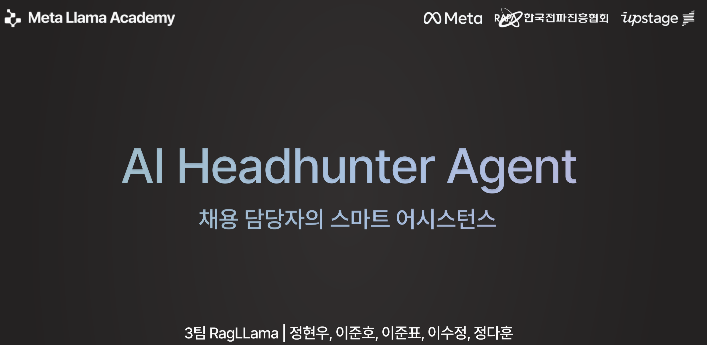
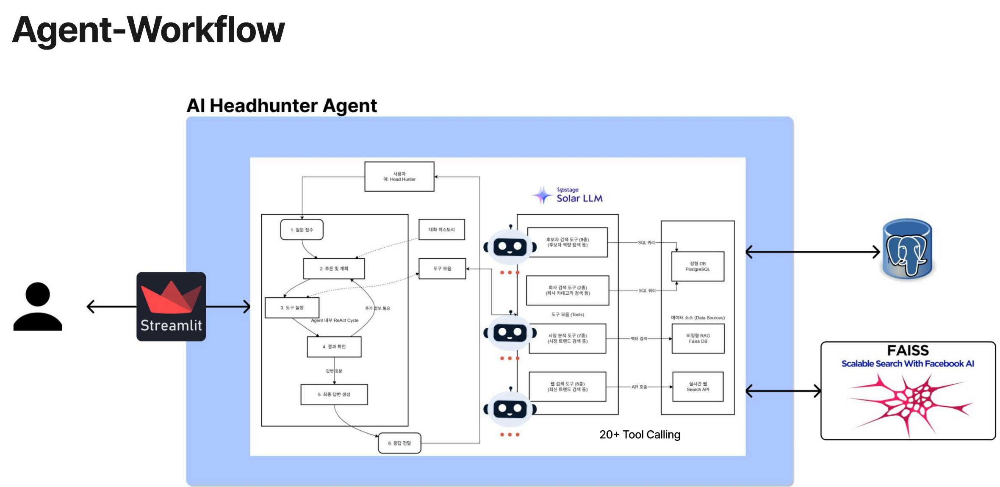

# AI Headhunter Agent

> AI 기반 헤드헌터 어시스턴트 - 자체 풀에서 인재 검색부터 시장 분석까지!

[](https://www.python.org/)
[](https://langchain-ai.github.io/langgraph/)
[](https://streamlit.io/)

## 주요 기능

### 완전한 `ReAct Agent` 구현
- **추론 + 행동 패턴**: LangGraph 기반 고급 워크플로우
- **20+ AI 도구**: 정형/비정형/실시간 데이터 통합
- **대화 메모리**: 세션 기반 컨텍스트 유지
- **스트리밍 응답**: 실시간 AI 응답 생성

### 3가지 데이터 소스 통합
1. **정형 데이터 (PostgreSQL)**
   - 인재 프로필 검색 (스킬, 지역, 급여)
   - 회사 정보 조회
   - 경험 태그 분석

2. **비정형 데이터 (FAISS RAG)**
   - 기술 정보 & 트렌드
   - 시장 분석 & 급여 정보
   - 산업 인사이트

3. **실시간 데이터 (Tavily 웹 검색)**
   - 최신 채용 공고
   - 기술 뉴스 
   - 회사 정보 업데이트

## 기본 아키텍처

```
┌─────────────────────────────────────────────────────────┐
│                    Streamlit UI (한글)                   │
│              chatbot_app.py (메인 챗봇)                  │
└────────────────────┬────────────────────────────────────┘
                     │
┌────────────────────▼────────────────────────────────────┐
│              ReAct Agent (LangGraph)                     │
│         react_agent.py - 추론 + 행동 패턴                │
└─────┬──────────────┬──────────────┬─────────────────────┘
      │              │              │
┌─────▼──────┐ ┌─────▼──────┐ ┌────▼──────┐
│PostgreSQL  │ │ FAISS RAG  │ │  Tavily   │
│(정형 데이터)│ │(비정형)    │ │(실시간)   │
└────────────┘ └────────────┘ └───────────┘
```



## 프로젝트 구조

```
headhunter-ai-agent/
├── data/
│   ├── structured/              # 정형 데이터 (CSV)
│   │   ├── company_info.csv
│   │   ├── talent_profile.csv
│   │   ├── exp_tag.csv
│   │   └── company_external_data.csv
│   │
│   └── unstructured/            # 비정형 데이터 (RAG)
│       ├── knowledge/
│       │   ├── tech_info.txt
│       │   ├── market_trends.txt
│       │   └── salary_info.txt
│       └── vector_store/        # FAISS 인덱스
│
├── src/
│   ├── agents/
│   │   ├── react_agent.py       # ⭐ ReAct 에이전트 (메인)
│   │   ├── enhanced_workflow.py # 고급 워크플로우
│   │   └── simple_agent.py
│   │
│   ├── services/
│   │   └── company_extractor.py # 🆕 회사명 추출 및 검증
│   │
│   ├── ui/
│   │   └── pdf_parser.py        # 🆕 PDF 파싱 및 JD 처리
│   │
│   ├── tools/
│   │   ├── candidate_tools.py   # 인재 검색 도구 (정형)
│   │   ├── market_tools.py      # 시장 분석 도구 (RAG)
│   │   └── web_search_tools.py  # 웹 검색 도구 (실시간)
│   │
│   ├── database/
│   │   ├── connection.py
│   │   ├── models.py
│   │   └── repositories.py
│   │
│   ├── vector_store/
│   │   ├── embedder.py
│   │   ├── faiss_store.py
│   │   └── knowledge_loader.py
│   │
│   └── streamlit_app/
│       ├── chatbot_app.py       # ⭐ 메인 챗봇 UI (한글 + JD 입력)
│       └── main.py              # 기본 UI
│
├── run.py                       # ⭐ 챗봇 실행 스크립트
├── run.bat                      # Windows용 실행 파일
│
├── scripts/                     # 유틸리티 스크립트
│   ├── import_data.py          # 데이터 임포트
│   └── install_deps.bat        # 의존성 설치
│
├── _backup/                     # 백업 폴더 (git ignored)
│   ├── old_code/
│   ├── deprecated/
│   └── tests/
├── docker-compose.yml
├── requirements.txt
└── README.md
```

## 프로젝트 시작 하기

### 1. 프로젝트 클론
```bash
git clone <repository-url>
cd headhunter-ai-agent
```

### 2. 패키지 & 가상환경 설정
```bash
uv sync
.venv\Scripts\activate

# Mac/Linux
source .venv/bin/activate
```

### 3. 환경 변수 설정
```bash
cp .env.example .env
```

`UPSTAGE_API_KEY` 값과 `TAVILY_API_KEY` 값, Lang Smith 관련 값 변경 필수

### 4. PostgreSQL 시작
```bash
docker compose up -d
```

### 5. 데이터 임포트
```bash
python scripts/import_data.py
```

### 6. AI 챗봇 실행 🎉

```bash
python run.py

# 또는 Windows에서
run.bat
```

브라우저가 자동으로 `http://localhost:8501`로 열립니다!

## 사용 쿼리 예시

### 인재 검색
```
👤 "Python 개발자 5명 추천해줘"
🤖 search_candidates_by_skills 도구를 사용하여 Python 스킬을 가진 후보자를 검색합니다...
   ✅ 5명의 Python 개발자를 찾았습니다:
   1. 홍길동 - 시니어 백엔드 개발자 (5년 경력)
   2. ...
```

### 시장 분석
```
👤 "데이터 사이언티스트 평균 연봉이 궁금해요"
🤖 1. search_salary_information (RAG) - 내부 급여 데이터 조회
   2. web_search_latest_trends (Tavily) - 최신 시장 급여 정보

   📊 분석 결과:
   - 평균 연봉: 7,500만원
   - 범위: 5,000 ~ 12,000만원
   - 트렌드: 전년 대비 15% 상승
```

### 복합 검색
```
👤 "서울 지역 5년차 이상 풀스택 개발자 중에서 원격근무 가능한 사람 찾아줘"
🤖 complex_candidate_search 도구를 사용합니다...
   조건: 스킬=풀스택, 지역=서울, 근무형태=원격

   ✅ 3명의 후보자를 찾았습니다:
   ...
```

## 핵심 기술 스택

| 카테고리 | 기술 | 용도 |
|---------|------|------|
| **AI Framework** | LangGraph | ReAct 에이전트 워크플로우 |
| **LLM** | Solar Pro (Upstage) | 한국어 최적화 언어 모델 |
| **Database** | PostgreSQL | 정형 데이터 저장 |
| **Vector DB** | FAISS | 비정형 데이터 검색 (RAG) |
| **Embedding** | jhgan/ko-sroberta | 한국어 임베딩 |
| **Web Search** | Tavily | 실시간 웹 검색 |
| **UI** | Streamlit | 대화형 웹 인터페이스 |
| **Container** | Docker | DB 컨테이너화 |

## API 키 발급

### 1. Upstage API (Solar LLM)
1. [Upstage Console](https://console.upstage.ai/) 가입
2. API 키 생성
3. `.env`의 `UPSTAGE_API_KEY`에 입력

### 2. Tavily API (웹 검색)
1. [Tavily](https://tavily.com/) 가입
2. 무료 API 키 발급
3. `.env`의 `TAVILY_API_KEY`에 입력

### 3. LangSmith 
1. [LangSmith](https://smith.langchain.com/) 가입
2. API 키 발급

## 테스트 쿼리 예시

### 정형 데이터 (PostgreSQL)
```
✅ "Python 개발자 찾아줘"
✅ "서울 지역 백엔드 개발자"
✅ "연봉 5000~8000만원 개발자"
✅ "원격근무 가능한 프론트엔드 개발자"
✅ "삼성에서 일하는 개발자 정보"
```

### 비정형 데이터 (RAG)
```
✅ "Python 기술의 특징과 사용 분야"
✅ "AI 개발자 시장 트렌드"
✅ "데이터 사이언티스트 평균 연봉"
✅ "React vs Vue.js 비교"
✅ "클라우드 엔지니어 시장 전망"
```

### 실시간 데이터 (웹 검색)
```
✅ "2024년 개발자 채용 시장 동향"
✅ "네이버 현재 채용 중인 포지션"
✅ "최근 ChatGPT 관련 개발자 뉴스"
✅ "토스 개발자 채용 정보와 회사 문화"
✅ "스타트업 투자 및 채용 뉴스"
```

### 복합 쿼리
```
✅ "3년차 프론트엔드 개발자인데 다음 커리어 추천"
✅ "Java 백엔드에서 AI 분야 전환하려면?"
✅ "5년차 풀스택 개발자 적정 연봉과 시장 데이터"
✅ "스타트업에서 시니어 Python 개발자 채용 전략"
```

## 추가 자료
- [LangGraph 공식 문서](https://langchain-ai.github.io/langgraph/)
- [Upstage Solar LLM](https://console.upstage.ai/)
- [Tavily API](https://tavily.com/)
- [Streamlit 문서](https://docs.streamlit.io/)
