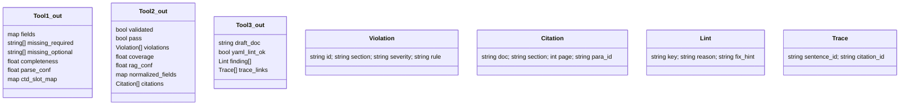

## 0)전체 오케스트레이션(Agent-->Tool 라우팅+UI)
```mermaid
flowchart LR
  U["사용자 업로드 composition (xlsx,xls,csv)"] --> A["LangChain Agent Llama-3.2-1B"]
  A -->|Tool1| T1["SmartDocumentTool Upstage Document AI"]
  T1 --> P1{필수 누락?}
  P1 -- 예 --> UI1[[UI: 누락 항목 리스트보정 안내 + 재업로드]]
  P1 -- 아니오 --> A

  A -->|Tool2| T2["RegulationToolRAG: Qdrant + Qwen3-0.6B"]
  T2 --> P2{규정 위반 Major?}
  P2 -- 예 --> N1["자동 표준화(normalize) 용어/형식 보정"] --> T2
  P2 -- 아니오 --> P3{근거 커버리지 충분?}
  P3 -- 아니오 --> SMore["스니펫 추가 검색 BM25 + Vector + MMR"] --> T2
  P3 -- 예 --> A

  A -->|Tool3| T3["GenerationTool Llama-3.2-3B-Instruct"]
  T3 --> V["출력 YAML 검증 체크리스트 룰"]
  V --> P4{yaml_lint_ok?}
  P4 -- 아니오 --> UI2[[UI: 규칙 위반 리포트 수정 가이드]]
  P4 -- 예 --> XAI["XAI 트레이서 문장-근거 매핑"]
  XAI --> OUT[[최종 결과: CTD 2.3.P.1 문 + 인용 + NEED_INPUT]]

  ```

  ---
## 1) Agent 제어 루프(FSM + ReAct 하이브리드)
  ```mermaid
stateDiagram-v2
  direction LR
  [*] --> S0
  S0: 수신
  S0 --> S1: 파일 파싱(Tool1)
  S1 --> S0: 실패재업로드
  S1 --> UI: 누락 존재
  S1 --> S2: 파싱 OK

  state S2 {
    direction TB
    [*] --> V1
    V1: 규정검증(Tool2.validate)
    V1 --> V2: Major 위반
    V2: normalize재검증
    V2 --> V1
    V1 --> V3: 커버리지 부족
    V3: 스니펫 확장
    V3 --> V1
    V1 --> Done: 통과
  }
  S2 --> S3: 규정 통과
  S3: 생성(Tool3.generate)
  S3 --> S2: YAML 실패
  S3 --> S4: 초안 + 인용
  S4: 결과 반환
  S4 --> [*]
  note right of S1: missing_required > 0 -> UI
  ```
---
## 2) 규칙+상태값 기반 Tool 라우터(가드 규칙+점수식)
  ```mermaid
flowchart TB
  subgraph Blackboard[블랙보드 상태]
    M1["parse.ok, missing_required, completeness, parse_conf"]
    M2["reg.validated, pass, violations, coverage, rag_conf"]
    M3["gen.yaml_lint_ok, citations_bound"]
  end

  A[Router] -->|가드| G1{필수 누락 있음?}
  G1 -- 예 --> UI1[[중단: 누락 안내]]
  G1 -- 아니오 --> G2{파싱 실패?}
  G2 -- 예 --> T1[Tool1]
  G2 -- 아니오 --> G3{규정 미검증?}
  G3 -- 예 --> T2[Tool2]
  G3 -- 아니오 --> G4{준수 통과 AND 완결성 95% 이상?}
  G4 -- 예 --> T3[Tool3]
  G4 -- 아니오 --> T2

  ```

  ---
## 스코어링(라우팅 우선순위)
-score(T1)= 1 - [parse.ok]
-core(T2)= [parse.ok] * (1 - [reg.validated])
-core(T3)= [parse.ok] * [reg.pass] * [completeness≥0.95]
-선택=argmax(score)  + 가드규칙(강제 라우팅)

---
## 3)블랙보드 I/O(도구 간 공유 상태)
```mermaid
flowchart LR
  %% 레이아웃
  subgraph T[Tools]
    direction TB
    T1["Tool1SmartDocumentTool"]
    T2["Tool2RegulationTool"]
    T3["Tool3GenerationTool"]
  end
  subgraph BB[Blackboard]
    direction TB
    P[("parse.summary")]
    R[("reg.status")]
    G[("gen.status")]
    C[("citations")]
  end
  Router[Agent Router]

  %% write(실선), read(점선) - 라벨 제거로 겹침 방지
  Router --> P
  Router --> R
  Router --> G
  Router --> C

  T1 --> P
  T2 --> R
  T3 --> G
  T3 --> C

  T1 -.-> P
  T2 -.-> P
  T3 -.-> P
  T3 -.-> R
  T2 -.-> C

  %% 범례
  subgraph Legend[Legend]
    W1[write] --> W2[ ]
    R1[read] -.-> R2[ ]
  end
```
---
## 4)ReAct 시퀀스(Thought->Action->Observation 루프)

---
## 5) 모델 내부 아키텍처(추론 경로)

---

## 6) 데이터 인덱싱 파이프라인

---
## 7) UI 피드백 플로우(누락/위반 리포트)


---

## 8) 도구 I/O 스키마(요약)

---
## 용어
-CTD(Common Technical Document, 의약품 공통기술문서)

-ICH(International Council for Harmonisation, 국제 의약품 규제 조화)

-MFDS(식품의약품안전처, 한국 규제기관)

-YAML(규칙,체크리스트 기술 포맷)

-Qdrant(벡터DB)

-Upstage Document Parse(문서 파싱)

-Llama 3.2 1B/3B(온디바이스 추론/생성)
